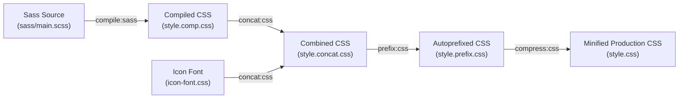

# 🌿 Natours — Adventure Tours Landing Page

[](https://developer.mozilla.org/en-US/docs/Web/HTML)
[](https://sass-lang.com/)
[](https://postcss.org/)
[](https://github.com/postcss/autoprefixer)
[](https://en.wikipedia.org/wiki/CSS)
[](https://opensource.org/licenses/ISC)

> A modern, fully responsive landing page for an outdoor adventure company, engineered from scratch using **advanced CSS and Sass**. Features **100% pure CSS interactivity** (zero JavaScript required) with complex 3D animations, custom responsive layouts, fluid typography, and professional build automation.

---

## 📑 Table of Contents

- [Overview](#-overview)
- [Key Features](#-key-features)
- [Zero-JS Interactive Highlights](#-zero-js-interactive-highlights)
- [Sass Architecture (7-1 Pattern)](#-sass-architecture-7-1-pattern)
- [Advanced CSS & Sass Techniques](#-advanced-css--sass-techniques)
- [Responsive Design Strategy](#-responsive-design-strategy)
- [Project Structure](#-project-structure)
- [Build Pipeline & NPM Scripts](#-build-pipeline--npm-scripts)
- [Getting Started](#-getting-started)
- [Behind the Scenes & Learning Notes](#-behind-the-scenes--learning-notes)
- [Author & Credits](#-author--credits)

---

## 🔭 Overview

**Natours** is an immersive, high-performance landing page concept designed to showcase how far modern CSS preprocessed with Sass can go without writing a single line of JavaScript. Every interactive feature—from full-screen navigation toggling and 3D card flips to floating input labels and target-based modal popups—is powered entirely by native CSS selectors, pseudo-classes, and transitions.

The project follows industry-standard **BEM (Block Element Modifier)** methodology and is architected using the scalable **7-1 Sass Pattern**, supported by an automated build pipeline featuring PostCSS, Autoprefixer, and CSS compression.

---

## ✨ Key Features

- **Hero Header with Angled Cut**: Diagonal slant crafted using CSS `clip-path: polygon()`, dual-gradient overlay with `background-blend-mode`, and smooth keyframe entrance animations.
- **Asymmetric Composition Gallery**: Layered image grid with custom hover states—hovering over an image scales it, elevates its `z-index`, applies an outline offset, and dims sibling photos (`:hover .photo:not(:hover)`).
- **Feature Highlights**: 4-column layout utilizing Linea icon font, custom float grid with `calc()`, and subtle card elevation upon hover.
- **3D Rotating Tour Cards**: Front and back card sides with 180° 3D flip effects via CSS `perspective` and `backface-visibility`, with graceful fallback for mobile touch screens.
- **Customer Stories with Video Background**: Looping HTML5 background video with `object-fit: cover`, paired with circular image wraps built using `shape-outside` and `clip-path: circle()`.
- **Custom Booking Form**: Floating placeholder labels, customized animated radio buttons, and live validation styling using `:focus` and `:invalid`.
- **Target-based Modal Popup**: Full-screen modal triggered by anchor hash links (`:target`) featuring backdrop blur effects (`backdrop-filter`) and multi-column text formatting.
- **Fullscreen Navigation**: Responsive radial overlay menu driven strictly by the CSS **Checkbox Hack**.
- **Retina & Responsive Images**: Art direction and density switching leveraging HTML5 `<picture>`, `srcset`, and `sizes` attributes.

---

## ⚡ Zero-JS Interactive Highlights

| Component                | Pure CSS Technique                                                        | Behavior                                                                                                                                                    |
| :----------------------- | :------------------------------------------------------------------------ | :---------------------------------------------------------------------------------------------------------------------------------------------------------- |
| **Navigation Menu**      | **Checkbox Hack** (`<input type="checkbox">` + `:checked ~ .nav`)         | Clicking hamburger icon scales the radial gradient background (`scale(100)`) and transitions links into view. Icon morphs into an 'X' using CSS transforms. |
| **3D Tour Cards**        | `perspective: 150rem` + `rotateY(180deg)` + `backface-visibility: hidden` | Hovering over a card flips it smoothly in 3D space to reveal tour details, pricing, and the booking CTA.                                                    |
| **Mobile Card Fallback** | Media query `@media (hover: none)`                                        | For touch devices where hover is unsupported, the card automatically reconfigures into a single vertical stack with the back-side always accessible.        |
| **Booking Modal**        | `:target` Pseudo-Class (`#popup:target`)                                  | Clicking "Book Now!" sets the URL hash to `#popup`, activating smooth zoom-in and opacity transitions. Closing sets hash to `#section-tours`.               |
| **Floating Form Labels** | `:placeholder-shown` + Adjacent sibling combinator (`+`)                  | While typing in inputs, the label animates upward into view. When empty, it cleanly hides behind the input.                                                 |
| **Stories Image Wrap**   | `shape-outside: circle()` + `clip-path: circle()` + `float: left`         | Text organically wraps around circular photos inside skewed review cards.                                                                                   |

---

## 🏛 Sass Architecture (7-1 Pattern)

The stylesheet structure strictly follows the industry-standard **7-1 Sass Architecture** to ensure modularity, scalability, and ease of maintenance:

```
sass/
├── abstracts/          # Tools, helpers & configuration (no direct CSS output)
│   ├── _functions.scss # Custom Sass calculation functions
│   ├── _mixins.scss    # Breakpoint media queries, clearfix, absCenter
│   └── _variables.scss # Brand colors, grid gutters, typography settings
│
├── base/               # Global resets, boilerplate & foundation
│   ├── _animations.scss# Keyframe animations (@keyframes moveInLeft, etc.)
│   ├── _base.scss      # Root HTML font-size, box-sizing, selection color
│   ├── _typography.scss# Headings, paragraph rules & text styles
│   └── _utilities.scss # Helper classes (u-center-text, u-margin-bottom-big)
│
├── components/         # Independent, self-contained reusable UI components
│   ├── _bg-video.scss  # Fullscreen HTML5 video background
│   ├── _button.scss    # Primary buttons, text links & animated pseudo-elements
│   ├── _card.scss      # 3D flippable tour cards & responsive touch layout
│   ├── _composition.scss# Interactive overlapping photo composition
│   ├── _feature-box.scss# Feature cards with icon and text
│   ├── _form.scss      # Floating label inputs & custom radio buttons
│   ├── _popup.scss     # Target-based modal dialog with backdrop filter
│   └── _story.scss     # Skewed testimonial cards with circular images
│
├── layout/             # Major structural sections of the page
│   ├── _footer.scss    # Footer navigation and copyright notice
│   ├── _grid.scss      # Custom float-based 12-column grid using calc()
│   ├── _header.scss    # Hero banner with polygon clip-path
│   └── _navigation.scss# Checkbox hack full-screen menu
│
├── pages/              # Page-specific styling
│   └── _home.scss      # Section paddings and background themes for Home
│
└── main.scss           # Master manifest importing all partials in order
```

---

## 🔬 Advanced CSS & Sass Techniques

### 1. The 62.5% Root Font-Size Strategy

To make responsive calculations predictable and ergonomic, the base font size is converted from the default browser `16px` to `10px`:

```scss
html {
  font-size: 62.5%; // 10px / 16px = 62.5% => 1rem = 10px

  @include respond(tab-land) {
    font-size: 56.25%;
  } // 1rem = 9px  (900px - 1200px)
  @include respond(tab-port) {
    font-size: 50%;
  } // 1rem = 8px  (600px - 900px)
  @include respond(big-desktop) {
    font-size: 75%;
  } // 1rem = 12px (1800px+)
}
```

All measurements (`rem`) automatically scale across all devices simply by modifying the root element font-size.

### 2. Custom Mixin Breakpoint Manager

Media queries are managed centrally through a reusable `@mixin respond($breakpoint)` using `em` units (1em = 16px):

```scss
@mixin respond($breakpoint) {
  @if $breakpoint == phone {
    @media only screen and (max-width: 37.5em) {
      @content;
    }
  } // < 600px
  @if $breakpoint == tab-port {
    @media only screen and (max-width: 56.25em) {
      @content;
    }
  } // < 900px
  @if $breakpoint == tab-land {
    @media only screen and (max-width: 75em) {
      @content;
    }
  } // < 1200px
  @if $breakpoint == big-desktop {
    @media only screen and (min-width: 112.5em) {
      @content;
    }
  } // > 1800px
}
```

### 3. Float Grid System with Native CSS `calc()`

Custom float-based grid with mathematical gutters:

```scss
.col-1-of-2 {
  width: calc((100% - #{$gutter-horizontal}) / 2);
}
.col-1-of-3 {
  width: calc((100% - 2 * #{$gutter-horizontal}) / 3);
}
```

### 4. Progressive Enhancement with `@supports`

Modern CSS features like `backdrop-filter` and `clip-path` are safeguarded with feature queries to ensure backward compatibility:

```scss
@supports (
  (-webkit-backdrop-filter: blur(10px)) or (backdrop-filter: blur(10px))
) {
  -webkit-backdrop-filter: blur(10px);
  backdrop-filter: blur(10px);
  background-color: rgba($color-black, 0.3);
}
```

---

## 📱 Responsive Design Strategy

- **Desktop-First Downscaling & Fluid Scaling**: Uses `max-width` media queries for standard viewports and `min-width` for ultra-wide desktop monitors.
- **Retina Displays & Art Direction**:
  - High-DPI background images targeted with `(min-resolution: 192dpi)` and `(-webkit-device-pixel-ratio: 2)`.
  - Responsive logo switching in the footer using HTML `<picture>` and `<source media="...">`.
  - Resolution and density switching on content images using `srcset` and `sizes`.
- **Touch Screen Adaptation**: The 3D cards gracefully shift to static layouts on touch-enabled devices that lack physical hover capability (`@media (hover: none)`).

---

## 📁 Project Structure

```
Natours/
├── css/
│   ├── fonts/               # Linea Basic 10 icon webfonts (eot, svg, ttf, woff)
│   ├── icon-font.css        # Linea icon font class definitions
│   ├── style.comp.css       # Compiled Sass output
│   ├── style.concat.css     # Concatenated styles (icon-font + compiled)
│   ├── style.prefix.css     # Autoprefixed styles
│   └── style.css            # Final minified production stylesheet
├── img/                     # Compressed JPG/PNG assets, favicons & video
│   ├── hero.jpg
│   ├── hero-small.jpg
│   ├── video.mp4
│   ├── video.webm
│   └── ...
├── sass/                    # Sass source files (7-1 pattern)
│   ├── abstracts/
│   ├── base/
│   ├── components/
│   ├── layout/
│   ├── pages/
│   └── main.scss
├── index.html               # Main HTML document
├── package.json             # Project dependencies & build scripts
└── README.md                # Project documentation
```

---

## 🛠 Build Pipeline & NPM Scripts

The project includes an automated front-end pipeline to compile, concatenate, autoprefix, and minify styles for production:



### Available NPM Commands

| Command                | Action                                                                                                             |
| :--------------------- | :----------------------------------------------------------------------------------------------------------------- |
| `npm run watch:sass`   | Watches `sass/main.scss` for changes and automatically recompiles to `css/style.css` in real-time.                 |
| `npm run compile:sass` | Compiles raw Sass files into `css/style.comp.css`.                                                                 |
| `npm run concat:css`   | Concatenates `css/icon-font.css` and `css/style.comp.css` into `css/style.concat.css`.                             |
| `npm run prefix:css`   | Runs PostCSS with Autoprefixer to inject vendor prefixes for cross-browser support.                                |
| `npm run compress:css` | Minifies the final prefixed CSS stylesheet for maximum performance.                                                |
| `npm run build:css`    | Runs the entire production build chain sequentially (`compile` &rarr; `concat` &rarr; `prefix` &rarr; `compress`). |

---

## 🚀 Getting Started

### Prerequisites

Make sure you have [Node.js](https://nodejs.org/) installed on your machine.

### Installation

1. **Clone the repository**:

   ```bash
   git clone https://github.com/Mohamed-Y0/Natours.git
   cd Natours
   ```

2. **Install project dependencies**:

   ```bash
   npm install
   ```

3. **Start development mode** (watch Sass files):

   ```bash
   npm run watch:sass
   ```

4. **Open in browser**:
   Open `index.html` directly in your favorite browser, or use VS Code's [Live Server](https://marketplace.visualstudio.com/items?itemName=ritwickdey.LiveServer) extension.

5. **Build for production**:
   ```bash
   npm run build:css
   ```

---

## 🧠 Behind the Scenes & Learning Notes

### How Browsers Render CSS

1. **Load & Parse HTML**: Reads the HTML document and constructs the **DOM (Document Object Model)**.
2. **Load & Parse CSS**:
   - Resolves conflicting declarations using the **Cascade** (Importance &rarr; Specificity &rarr; Source Order).
   - Computes absolute values (percentages, `rem`, `vh` to absolute `px`), constructing the **CSSOM (CSS Object Model)**.
3. **Render Tree**: Combines the DOM and CSSOM to build the tree of visible nodes.
4. **Layout (Reflow)**: Calculates the exact geometry, position, and dimensions of each element on the screen.
5. **Painting**: Fills in pixels on the screen (colors, images, borders, shadows) and creates rendering layers.
6. **Compositing**: Flattens layers into the final displayed frame on the GPU.

### CSS Cascade & Specificity Hierarchy

```
Inline Styles (1, 0, 0, 0)
    ↓
IDs (#id) (0, 1, 0, 0)
    ↓
Classes (.class), Pseudo-classes (:hover), Attribute selectors ([type="text"]) (0, 0, 1, 0)
    ↓
Elements (div, h1) & Pseudo-elements (::after) (0, 0, 0, 1)
    ↓
Universal Selector (*), Combinators (+, >, ~) (0, 0, 0, 0)
```

---

## 👤 Author & Credits

- **Author**: Mohamed ([@Mohamed-Y0](https://github.com/Mohamed-Y0))
- **Design & Concept**: Inspired by the Natours project in Jonas Schmedtmann's _Advanced CSS and Sass_ course.
- **Icons**: Linea Basic 10 Icon Set.
- **Typography**: Lato via [Google Fonts](https://fonts.google.com/specimen/Lato).

---

<p align="center">Made with 💚 and pure modern CSS/Sass</p>
